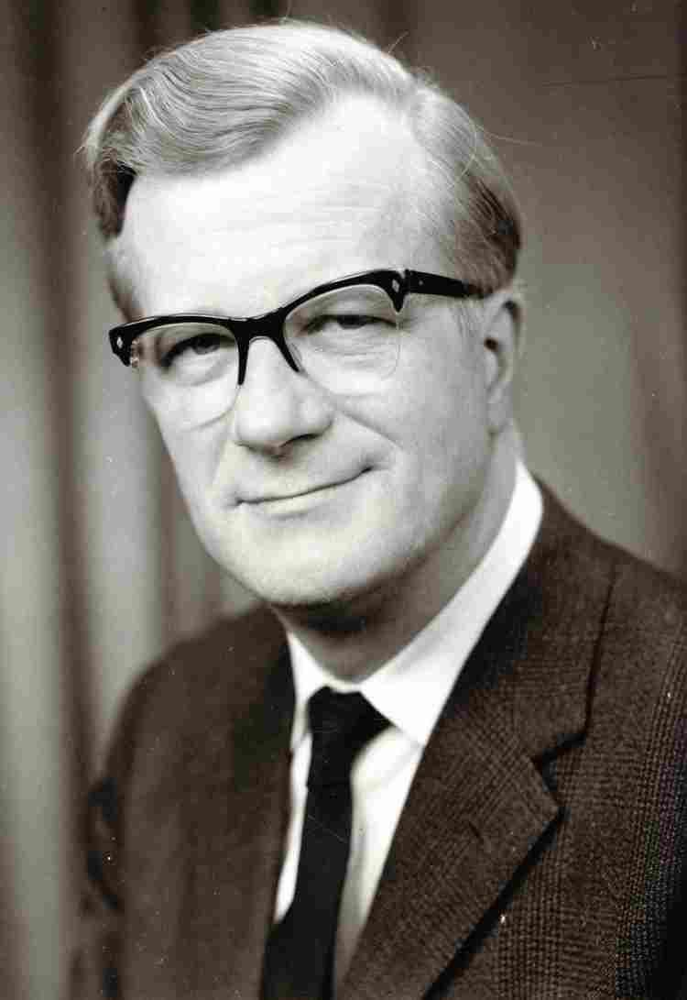
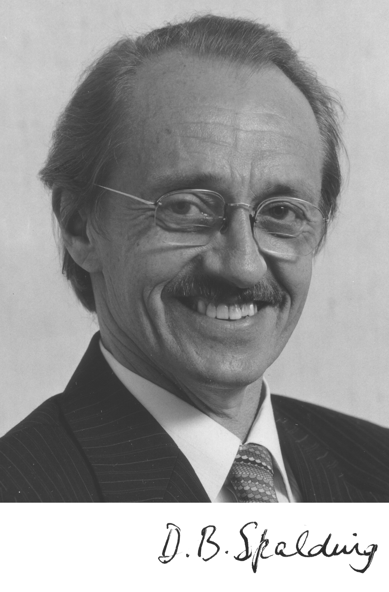
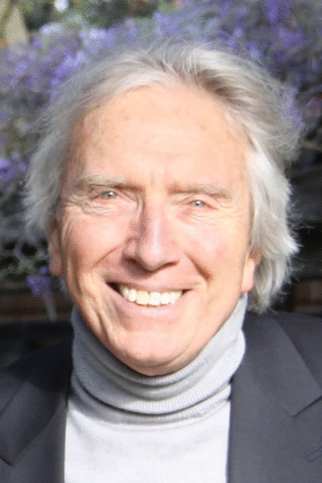
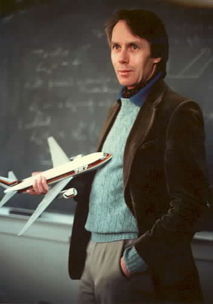
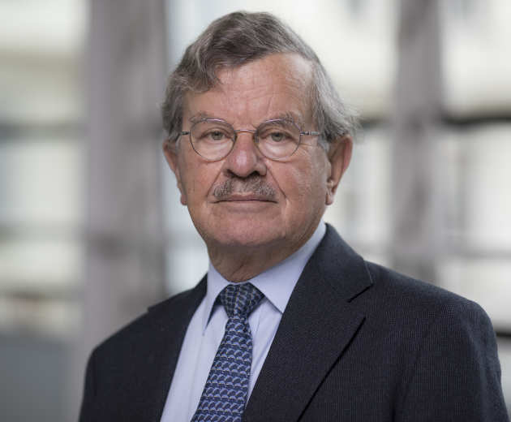

# Celebrities in history

### Dietrich Küchemann (11 September 1911 – 23 February 1976)  

<figcaption>Dietrich Küchemann</figcaption>

[wiki](https://en.wikipedia.org/wiki/Dietrich_K%C3%BCchemann)  

### Dudley Brain Spalding (9 January 1923 – 27 November 2016)   

<figcaption>Dudley Brian Spalding</figcaption>

[wiki](https://www.wikiwand.com/en/Brian_Spalding) 
[Royal Society](https://royalsocietypublishing.org/doi/10.1098/rsbm.2018.0024) 

### Brian Launder

<figcaption>Brian_Launder</figcaption>

[wiki](https://en.wikipedia.org/wiki/Brian_Launder)
[researchgate](https://www.researchgate.net/profile/Brian-Launder)  
[homepage](https://www.research.manchester.ac.uk/portal/brian.launder.html)
[googlescholar](https://scholar.google.com.hk/citations?hl=zh-CN&user=Y3JbAK8AAAAJ)

### Antony Jameson (20 November 1934 CFD, code)  

<figcaption>Antony Jameson</figcaption>

中心差分离散的有限体积法  
[homepage](http://aero-comlab.stanford.edu/jameson/) 
[googlescholar](https://scholar.google.com/citations?hl=en&user=74eUkXgAAAAJ&view_op=list_works&citft=1&email_for_op=dlxiaochemi%40gmail.com&sortby=pubdate) 
[scopus](https://www.scopus.com/authid/detail.uri?origin=resultslist&authorId=57198148688&zone=) 
[wiki](https://www.wikiwand.com/en/Antony_Jameson)  

### David Gosman 

<figcaption>David Gosman</figcaption>

[homepage](https://www.imperial.ac.uk/people/d.gosman/publications.html) 

[Icons of CFD: David Gosman](https://www.hpctoday.com/best-practices/icons-of-cfd-david-gosman/)

### Ligrani, Phillip M.  (cooling)  
[homepage](https://www.uah.edu/eng/departments/mae/faculty-staff/phillip-ligrani)
[personal website](https://ligrani.com/)
[scopus](https://www.scopus.com/authid/detail.uri?authorId=7007125186)  

### 陈大燮
  

<!--    -->
