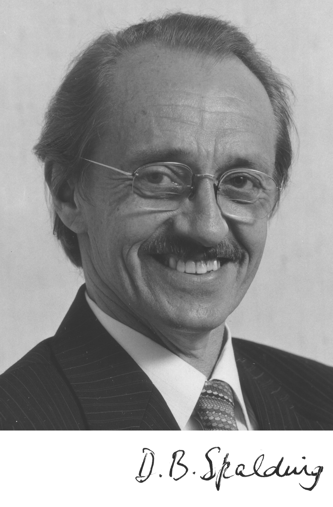

# Celebrities in history

### Dietrich Küchemann (11 September 1911 – 23 February 1976)  

[[wiki]](https://en.wikipedia.org/wiki/Dietrich_K%C3%BCchemann)  

### Dudley Brain Spalding (9 January 1923 – 27 November 2016)   

<figcaption>Dudley_Brian_Spalding</figcaption>

[[wiki]](https://www.wikiwand.com/en/Brian_Spalding) 
[[Royal Society]](https://royalsocietypublishing.org/doi/10.1098/rsbm.2018.0024) 

### Antony Jameson (20 November 1934 CFD, code)  
中心差分离散的有限体积法  
[[homepage]](http://aero-comlab.stanford.edu/jameson/) 
[[googlescholar]](https://scholar.google.com/citations?hl=en&user=74eUkXgAAAAJ&view_op=list_works&citft=1&email_for_op=dlxiaochemi%40gmail.com&sortby=pubdate) 
[[scopus]](https://www.scopus.com/authid/detail.uri?origin=resultslist&authorId=57198148688&zone=) 
[[wiki]](https://www.wikiwand.com/en/Antony_Jameson)  

### David Gosman 

[[homepage]](https://www.imperial.ac.uk/people/d.gosman/publications.html) 

### Ligrani, Phillip M.  (cooling)  
[[homepage]](https://www.uah.edu/eng/departments/mae/faculty-staff/phillip-ligrani)
[[personal website]](https://ligrani.com/)
[[scopus]](https://www.scopus.com/authid/detail.uri?authorId=7007125186)  

## 陈大燮

  

<!--    -->
