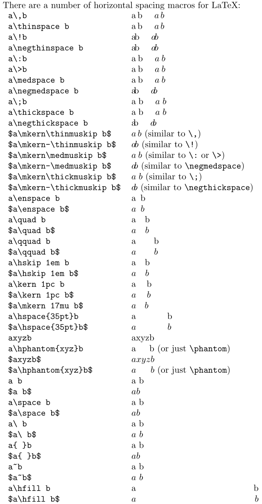

# LaTeX notes


**reference**

* [katex](https://katex.org/docs/supported.html)
* https://matnoble.me/tech/latex/latex/


# LaTeX

## equation

$\tilde{x}$
```latex

$\tilde{x}$
```

$\widetilde{x_2}$
```latex
$\widetilde{x_2}$
```

$\tilde{A}_2$
```latex
$\tilde{A}_2$
```

$\widetilde{A}_2$
```latex
$\widetilde{A}_2$
```

$x_1,\cdots, x_n$
```latex
$x_1,\cdots, x_n$
```

$x_1,\ldots, x_n$
```latex
$x_1,\ldots, x_n$
```


## Greek alphabet

| Lowercase | Uppercase |        latex         |
| :-------: | :-------: | :------------------: |
|     α     |     A     |        \alpha        |
|     β     |     B     |        \beta         |
|     γ     |     Γ     |        \gamma        |
|     δ     |     Δ     |        \delta        |
|     ϵ     |     E     |       \epsilon       |
|     ζ     |     Z     |        \zeta         |
|     ν     |     N     |         \nu          |
|     ξ     |     Ξ     |         \xi          |
|     ο     |     O     |       \omicron       |
|     π     |     Π     |         \pi          |
|     ρ     |     P     |         \rho         |
|     σ     |     Σ     |        \sigma        |
|     η     |     H     |         \eta         |
|     θ     |     Θ     |        \theta        |
|     ι     |     I     |        \iota         |
|     κ     |     K     |        \kappa        |
|     λ     |     Λ     |       \lambda        |
|     μ     |     M     |         \mu          |
|     τ     |     T     |         \tau         |
|     υ     |     Υ     |       \upsilon       |
|     ϕ     |     Φ     | \phi，（φ：\varphi） |
|     χ     |     X     |         \chi         |
|     ψ     |     Ψ     |         \psi         |
|     ω     |     Ω     |        \omega        |

## 数学符号
|       符号       |       LATEX code        |              Description              |
| :--------------: | :---------------------: | :-----------------------------------: |
|       根号       |       \sqrt[3]{12}       |             $\sqrt[3]{12}$             |
|       分数       |    \frac{分子}{分母}    |             $\frac{1}{2}$             |
|       求和       |   \sum_{下标}^{上标}    |          $\sum_{n=1}^{100}$           |
|      上划线      |     \overline{式子}     |            $\overline{a}$             |
|      下划线      |    \underline{式子}     |            $\underline{a}$            |
|      罗马体      |      \mathrm{字符}      | $\mathrm{abcdefghijklmnopqrstuvwxyz}$ |
|     顶部曲线     |       \tilde{字}        |              $\tilde{a}$              |
|      约等于      |         \approx         |               $\approx$               |
|     小于等于     |          \leq           |                $\leq$                 |
|     大于等于     |          \geq           |                $\geq$                 |
| 字母顶部的小折线 |       \hat{字母}        |               $\hat{}$                |
|     相似符号     |          \sim           |                $\sim$                 |
|      下注释      | \arg \underset{y}{\max} |       $\arg \underset{y}{\max}$       |
|       梯度       |         \nabla          |               $\nabla$                |
|       偏导       |        \partial         |              $\partial$               |
|      省略号      |   \cdots，单个为\cdot   |        $\cdots$，单个为$\cdot$        |
|     花体大写     |       \mathscr{F}       |             $\mathscr{F}$             |
|       空集       |       \varnothing       |             $\varnothing$             |
|     向右箭头     |       \varnothing       |             $\rightarrow$             |
|       属于       |           \in           |                 $\in$                 |
| 元素乘（空心圆） |          \circ          |                $\circ$                |
|     加粗斜体     |    \boldsymbol{内容}    |           $\boldsymbol{A}$            |
|                  |     \mathcal{内容}      |             $\mathcal{A}$             |
|                  |      \mathbb{内容}      |             $\mathbb{A}$              |
|      正比于      |         \propto         |               $\propto$               |
|       无穷       |         \infty          |               $\infty$                |
|       任意       |         \forall         |               $\forall$               |
|       存在       |         \exists         |               $\exists$               |
|       向量       |         \vec{A}         |               $\vec{A}$               |
|     向量点乘     |          \cdot          |                $\cdot$                |

## spacing
|                            spacing                            | LATEX code | Description  |
| :-----------------------------------------------------------: | :--------: | :----------: |
|                   twice of \quad (= 36 mu)                    | a \qquad b | $a \qquad b$ |
|  \quad	space equal to the current font size (= 18 mu = 1 em)  | a \quad b  | $a \quad b$  |
| \ (space after backslash!) equivalent of space in normal text |    a\ b    |    $a\\ b$    |
|                    5/18 of \quad (= 5 mu)                     |   `a\;b`    |    $a\\;b$    |
|                    4/18 of \quad (= 4 mu)                     |   `a\:b`    |    $a\\:b$    |
|                    3/18 of \quad (= 3 mu)                     |   `a\,b`   |    $a\\,b$    |
|                           no space                            |     ab    |     $ab$     |
|                   -3/18 of \quad (= -3 mu)                    |   `a\!b`    |    $a\\!b$    |

* \displaystyle        显示公式的标准尺寸  简记 D
* \textstyle          正文公式的标准尺寸   简记 T
* \scriptstyle         上下标的标准尺寸     简记 S
* \scriptscriptstyle   更低层的上下标的标准尺寸   简记 SS

<br>

[What commands are there for horizontal spacing?](https://tex.stackexchange.com/questions/74353/what-commands-are-there-for-horizontal-spacing?newreg=a57b9d48fa7d404b87f5da9c7ed1664d)  
There are a number of horizontal spacing macros for LaTeX:  
**math mode:** `$\:$`

1. `\,` inserts a `.16667em` space in text mode, or `\thinmuskip` (equivalent to `3mu`) in math mode; there's an equivalent `\thinspace` macro;
2. `\!` is the *negative* equivalent to `\,`; there's an equivalent `\negthinspace` macro;
3. `\>` (or `\:`) inserts a `.2222em` space in text mode, or `\medmuskip` (equivalent to `4.0mu plus 2.0mu minus 4.0mu`) in math mode; there's an equivalent `\medspace`;
4. `\negmedspace` is the *negative* equivalent to `\medspace`;
5. `\;` inserts a `.2777em` space in text mode, or `\thickmuskip` (equivalent to `5.0mu plus 5.0mu`) in math mode; there's an equivalent `\thickspace`;
6. `\negthickspace` is the *negative* equivalent to `\thickspace`;
7. `\enspace` inserts a space of `.5em` in text or math mode;
8. `\quad` inserts a space of `1em` in text or math mode;
9. `\qquad` inserts a space of `2em` in text or math mode;
10. `\kern <len>` inserts a skip of `<len>` (may be negative) in text or math mode (a plain TeX skip); there's also a `m`ath-specific `\mkern <math len>`;
11. `\hskip <len>` (similar to `\kern`);
12. `\hspace{<len>}` inserts a space of length `<len>` (may be negative) in math or text mode (a LaTeX `\hskip`);
13. `\hphantom{<stuff>}` inserts space of length equivalent to `<stuff>` in math or text mode. `\phantom{<stuff>}` is similar, inserting a horizontal and vertical space that matches `<stuff>`. Should be `\protect`ed when used in fragile commands (like `\caption` and sectional headings);
14. `\ ` inserts what is called a "control space" (in text or math mode);
15. ` ` inserts an inter-word space in text mode (and is gobbled in math mode). Similarly for `\space` and `{ }`.
16. `~` inserts an "unbreakable" space (similar to an HTML ` `) (in text or math mode);
17. `\hfill` inserts a so-called "rubber length" or stretch between elements (in text or math mode). Note that you may need to provide a type of anchor to fill from/to; see [What is the difference between `\hspace*{\fill}` and `\hfill`?](https://tex.stackexchange.com/q/45948/5764);




```Latex
 \verb|a\,b|                     & a\,b \quad $a\, b$ \\
  \verb|a\thinspace b|            & a\thinspace b \quad $a\thinspace b$ \\
  \verb|a\!b|                     & a\!b \quad $a\!b$ \\
  \verb|a\negthinspace b|         & a\negthinspace b \quad $a\negthinspace b$ \\
  \verb|a\:b|                     & a\:b \quad $a\:b$ \\
  \verb|a\>b|                     & a\>b \quad $a\>b$ \\
  \verb|a\medspace b|             & a\medspace b \quad $a\medspace b$ \\
  \verb|a\negmedspace b|          & a\negmedspace b \quad $a\negmedspace b$ \\
  \verb|a\;b|                     & a\;b \quad $a\;b$ \\
  \verb|a\thickspace b|           & a\thickspace b \quad $a\thickspace b$ \\
  \verb|a\negthickspace b|        & a\negthickspace b \quad $a\negthickspace b$ \\
  \verb|$a\mkern\thinmuskip b$|   & $a\mkern\thinmuskip b$ (similar to \verb|\,|) \\
  \verb|$a\mkern-\thinmuskip b$|  & $a\mkern-\thinmuskip b$ (similar to \verb|\!|) \\
  \verb|$a\mkern\medmuskip b$|    & $a\mkern\medmuskip b$ (similar to \verb|\:| or \verb|\>|) \\
  \verb|$a\mkern-\medmuskip b$|   & $a\mkern-\medmuskip b$ (similar to \verb|\negmedspace|) \\
  \verb|$a\mkern\thickmuskip b$|  & $a\mkern\thickmuskip b$ (similar to \verb|\;|) \\
  \verb|$a\mkern-\thickmuskip b$| & $a\mkern-\thickmuskip b$ (similar to \verb|\negthickspace|) \\
  \verb|a\enspace b|              & a\enspace b \\
  \verb|$a\enspace b$|            & $a\enspace b$ \\
  \verb|a\quad b|                 & a\quad b \\
  \verb|$a\quad b$|               & $a\quad b$ \\
  \verb|a\qquad b|                & a\qquad b \\
  \verb|$a\qquad b$|              & $a\qquad b$ \\
  \verb|a\hskip 1em b|            & a\hskip 1em b \\
  \verb|$a\hskip 1em b$|          & $a\hskip 1em b$ \\
  \verb|a\kern 1pc b|             & a\kern 1pc b \\
  \verb|$a\kern 1pc b$|           & $a\kern 1pc b$ \\
  \verb|$a\mkern 17mu b$|         & $a\mkern 17mu b$ \\
  \verb|a\hspace{35pt}b|          & a\hspace{35pt}b \\
  \verb|$a\hspace{35pt}b$|        & $a\hspace{35pt}b$ \\
  \verb|axyzb|                    & axyzb \\
  \verb|a\hphantom{xyz}b|         & a\hphantom{xyz}b (or just \verb|\phantom|) \\
  \verb|$axyzb$|                  & $axyzb$ \\
  \verb|$a\hphantom{xyz}b$|       & $a\hphantom{xyz}b$ (or just \verb|\phantom|) \\
  \verb|a b|                      & a b \\
  \verb|$a b$|                    & $a b$ \\
  \verb|a\space b|                & a\space b \\
  \verb|$a\space b$|              & $a\space b$ \\
  \verb|a\ b|                     & a\ b \\
  \verb|$a\ b$|                   & $a\ b$ \\
  \verb|a{ }b|                    & a{ }b \\
  \verb|$a{ }b$|                  & $a{ }b$ \\
  \verb|a~b|                      & a~b \\
  \verb|$a~b$|                    & $a~b$ \\
  \verb|a\hfill b|                & a\hfill b \\
  \verb|$a\hfill b$|              & $a\hfill b$

```

```

```

```

```
