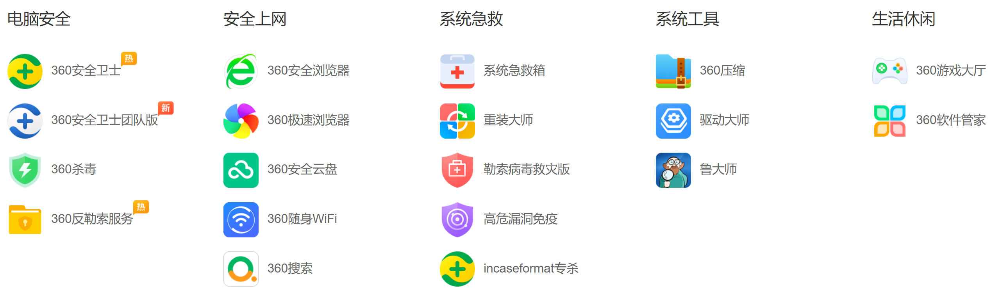
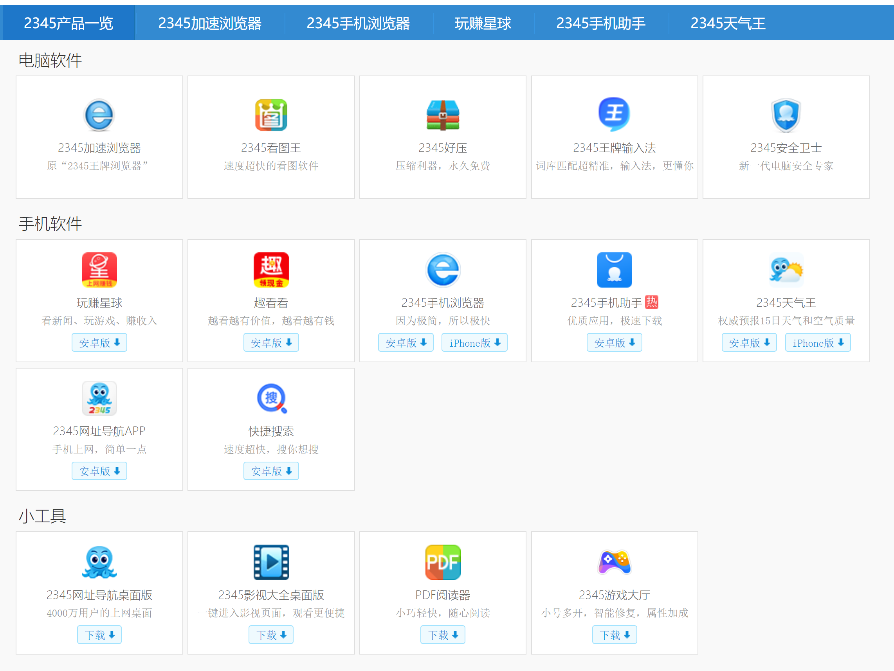

# Research tools

## List of recommended software

### zotero
a free and open-source reference management software  

* [Zotero | 01-为什么要用文献管理软件Zotero](https://www.bilibili.com/video/BV1cJ411h77k)
* [zotero 中文识别](https://www.bilibili.com/read/cv6968662/)

### typora

a markdown editor  
  

### obsidian
a markdown editor  


### everything   
a free desktop search utility  


### 7-zip
a free and open-source file archiver  


### Input Method Editor
Windows 10 IME

### anydesk/teamviewer/todesk

remote control software







### Norton/Avast/Microsoft Defender Antivirus in Windows10
Anti-virus or anti-malware software

### Operating system
* [Redhat](https://developers.redhat.com/products/rhel/download)

* [Centos](https://www.centos.org/)

* [Ubuntu](https://www.ubuntu.com/)

* [Win10](https://www.microsoft.com/zh-cn/software-download/windows10)

* [macOS Bug Sur](https://www.apple.com/macos/big-sur/)

  

## List of STRONGLY NOT recommended software forever

* **360**  

* XX电脑管家

* 2345

  

* 驱动精灵

* ...to be continued...

**reference**

- [国产App为什么如此“臃肿”？！](https://www.cnblogs.com/SNSD-99/p/14383023.html)
- [现在的很多国产软件为何如此恶臭？](https://www.zhihu.com/question/434638074)
- [最流氓的软件可以流氓到什么程度？](https://www.zhihu.com/question/29129310/answers/updated)

