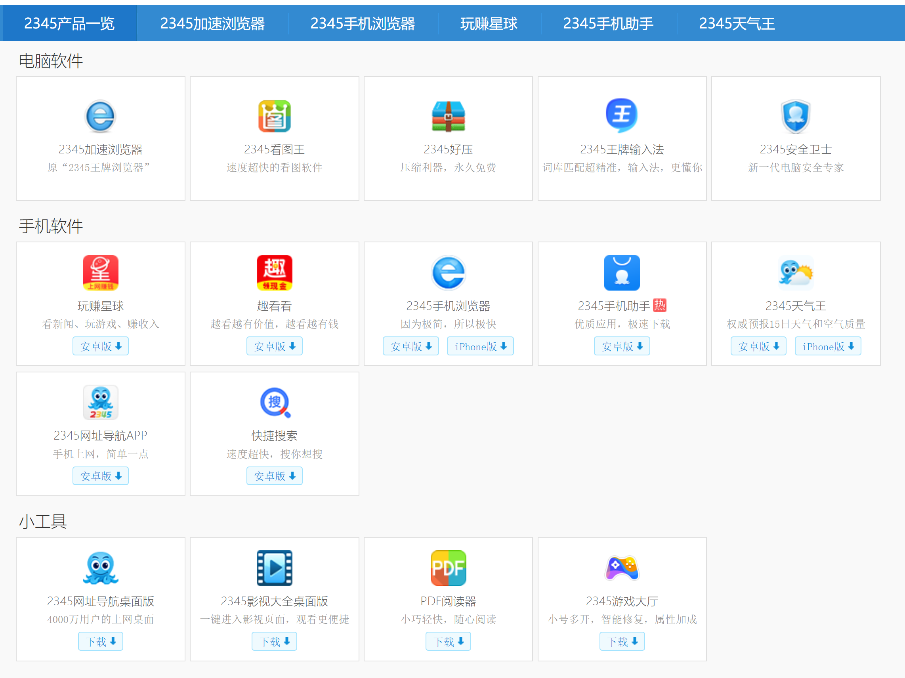

# Research tools(software)

## List of recommended software

### Web browser
- Google Chrome 
- Microsoft Edge 

#### Chrome extension compatible with Edge
- [Bookmarks clean up](https://chrome.google.com/webstore/detail/bookmarks-clean-up/oncbjlgldmiagjophlhobkogeladjijl?hl=en)  
Find and remove duplicated bookmarks
- [uBlock Origin](https://chrome.google.com/webstore/detail/ublock-origin/cjpalhdlnbpafiamejdnhcphjbkeiagm)  
  Ad-blocking

### zotero
a free and open-source reference management software  

* [Zotero | 01-为什么要用文献管理软件Zotero](https://www.bilibili.com/video/BV1cJ411h77k)
* [zotero 中文识别](https://www.bilibili.com/read/cv6968662/)

### typora

a markdown editor $ 14.99  
  

### obsidian
a free markdown editor  


### everything   
a free desktop search utility  


### 7-zip
a free and open-source file archiver  


### Input Method Editor
Windows 10 IME pre-installed

### anydesk/teamviewer/todesk

remote control software

-    

-    

-    

### Norton/Microsoft Defender Antivirus in Windows10
Anti-virus or anti-malware software
- Norton™ AntiVirusPlus | Norton™ Antivirus 增强版  
  Note: 每年自动续订的价格变化
- Microsoft Defender Antivirus pre-installed in Windows10

### Dictionary
- 欧路词典Eudic
  
- GoldenDict  
  Download: [64bit](https://sourceforge.net/projects/goldendict/files/early%20access%20builds/Qt5-based/64bit/)  
  Theme location：`C:\Users\xxx\AppData\Roaming\GoldenDict\styles`

### ffmpeg
A complete, cross-platform solution to record, convert and stream audio and video.  
  

### VMware workstation pro
virtual machine, download [here](https://www.vmware.com/products/workstation-pro/workstation-pro-evaluation.html)

### Operating system
* [Redhat](https://developers.redhat.com/products/rhel/download)

* [Centos](https://www.centos.org/)

* [Ubuntu](https://www.ubuntu.com/)

* [Win10](https://www.microsoft.com/zh-cn/software-download/windows10)

* [macOS Bug Sur](https://www.apple.com/macos/big-sur/)

 

## List of STRONGLY NOT recommended software forever

- **360 全家桶**  

- XX电脑管家

- **2345 全家桶**

- 驱动精灵

- ...to be continued...

**reference**

- [国产App为什么如此“臃肿”？！](https://www.cnblogs.com/SNSD-99/p/14383023.html)
- [现在的很多国产软件为何如此恶臭？](https://www.zhihu.com/question/434638074)
- [最流氓的软件可以流氓到什么程度？](https://www.zhihu.com/question/29129310/answers/updated)
- [如何评价苏州思杰马克丁软件公司？](https://www.zhihu.com/question/46746200)
- [国产软件为什么越来越流氓？](https://blog.csdn.net/qq_21388535/article/details/80080571?utm_source=blogxgwz0)
- [鲁大师已经彻底沦为一款垃圾流氓软件！](https://zhuanlan.zhihu.com/p/108041500)

